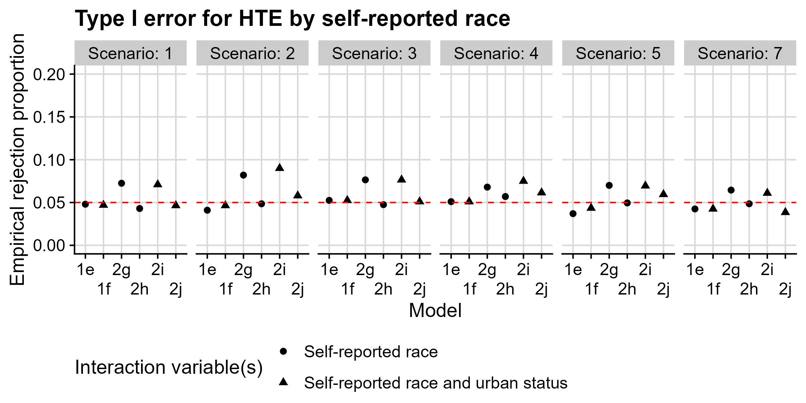
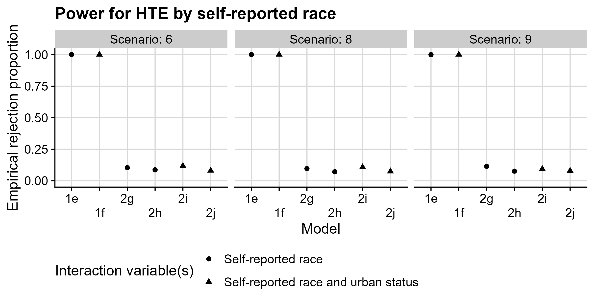

```{r xaringan-setup, include=FALSE, warning=FALSE}
library("xaringanthemer")
library("dplyr")
library("knitr")
library("kableExtra")
extra_css <- list(
  ".small" =  list(`font-size` = "80%"),
  ".large" =  list(`font-size` = "150%"),
  ".huge" =  list(`font-size` = "300%"),
  "ul li" = list(`margin-bottom` = "10px"),
  ".gray" = list(color = "#C0C0C0"),
  ".red" = list(color = "#FF0000"),
  ".green" = list(color = "#097969"),
  ".blue1" = list(color = "#3AABBE"),
  ".blue2" = list(color = "#2A6D90"),
  ".blue3" = list(color = "#446874"),
  ".purple" = list(color = "#624474"),
  ".mutedred" = list(color = "#745344"),
  "a" = list(color = "#3AABBE"),
  "a:hover" = list("text-decoration" = "underline")
)
# set up fonts
style_mono_accent(
  base_color = "#446874",
  header_font_google = google_font("DM Sans"),
  text_font_google   = google_font("DM Sans", "400", "400i"),
  code_font_google   = google_font("Courier Prime"),
  extra_css = extra_css
)

xaringanExtra::use_tile_view()
```

<style type="text/css">
.remark-slide-content {
    font-size: 20px
    header-h2-font-size: 1.75rem;
}
</style>

## Acknowledgments

This work was done in collaboration with:
```{r acknowledgments, echo = FALSE, fig.show = "hold", out.height = "100%", out.width="80%", fig.align = "center"}
knitr::include_graphics(c(
    "img/people1.PNG"
  ))
```

and was funded by the Patient-Centered Outcomes Research Institute (COVID-2021C2-1368)

---

## Heterogeneity of treatment effects: what and why

**Heterogeneity of treatment effects**:
* differential effect of exposure/intervention across subgroups
* .green[does not necessarily imply a causal or biological interpretation]

--

If HTE is present:
* .blue1[resources can be prioritized] to maximize benefit and reduce risks .small[[Knol and VanderWeele (2012)]]
* can determine whether intervention .green[remediates] or .red[exacerbates] health disparities .small[[Petkovic et al. (2020)]]

---

## Case study: ENSPIRE trial

**ENSPIRE**: Engaging Staff to Improve COVID-19 Vaccination Response at Long-term Care Facilities

&zwj;Background:
* Rates of COVID-19 disease and death higher in long-term care than general population .small[[Chidambaram (2022)]]
* Lag in COVID-19 vaccinations among long-term care workers
* Long-term care (LTC) workers often low-wage, represent diverse social, cultural, racial, and ethnic backgrounds

--

&zwj;Design:
* Enrolled 40 LTC centers, encompassing approximately 4000 staff members
* Recruited from 2 US states (Georgia and Washington)
* Recruited from urban (Atlanta or Seattle) and suburban/rural locations

---

## Case study: ENSPIRE trial

.blue1[Primary outcomes:]
1. LTC center COVID-19 booster rate (.blue1[cluster-level])
  * chosen due to concerns about data capture
2. LTC care staff net promoter score (.blue2[individual-level])

.green[Intervention:] booster promotion materials co-designed with LTC staff

```{r intervention, echo = FALSE, fig.show = "hold", out.height = "100%", out.width="80%", fig.align = "center"}
knitr::include_graphics(c(
    "img/enspire_intervention.PNG"
  ))
```

---

## Case study: ENSPIRE trial

Co-design: .green[tailoring] messages to specific audiences
* In ENSPIRE, focused on .blue1[language, cultural, and ethnic affinity] groups
* Measured race and ethnicity allowing 57 total options 

--

HTE analysis natural for interventions, particularly co-designed:
* Planned analyses based on state, urban vs suburban/rural, baseline booster uptake
* Self-reported race and ethnicity both interesting and important, however:
  * neither sites nor other entity had comprehensive and accurate race and ethnicity data for staff
  * staff survey would only capture a portion of staff members
  * also, didn't know what this would look like with a cluster-level outcome!

---

## Individual-level data structure

Data on $n_c$ staff members in each cluster $c = 1, \ldots, K$:
* $A_{ci}$: indicator of intervention assignment (cluster-level)
* $Z_{ci} \in \mathbb{R}^q$: cluster-level subgroup variables
* $W_{ci} \in \mathbb{R}^p$: baseline covariates
* $Y_{ci}$: binary outcome

---

## HTE with individual-level outcomes

Suppose we are interested in HTE by a single binary variable $W_{ci}$.

Target estimand: the .blue1[difference in the risk difference] based on levels of $W_{ci}$.

Estimate using linear regression:
$$E(Y_{ci} \mid A_{ci} = a, Z_{ci} = z, W_{ci} = w) = \beta_0 + \beta_1a + \beta_2z + \beta_3w + \beta_4aw.$$
--

Under standard assumptions, $\beta_4$ quantifies HTE.

---

## Cluster-level data structure

In many settings, we observe cluster-level data:
* $\overline{Y}_c := \frac{1}{n_c}\sum_{i=1}^{n_c} Y_{ci}$: cluster-level outcome proportion
* $A_c$: indicator of intervention assignment
* $Z_c \in \mathbb{R}^q$: cluster-level subgroup variables
* $X_c \in \mathbb{R}^p$: (possibly aggregated) baseline covariates

--

Possible options for aggregating an individual-level covariate $W_{cj}$:
* $X_{cj} = V_{cj} - \frac{1}{K}\sum_{c=1}^K V_{cj}$, where $V_{cj} = \frac{1}{n_c}\sum_{i=1}^{n_c}W_{cji}$
* $X_{cj} = I\left(V_{cj} > t\right)$ for threshold $t$

---

## Aggregated data: complications

Individual-level effects .red[may not be identifiable] based on aggregate data
* Often referred to as .red[ecological bias] .small[[Wakefield (2008)]]
* Exposure-outcome association can be biased: .small[[Greenland & Morgenstern (1989)]]
  * by aggregated confounders
  * by aggregated HTE variables

--

Compositional data cause challenges in .red[interpretation]:
* Arise when aggregating mutually-exclusive binary variables
* Changing the value of one proportion .green[necessarily changes] at least one other

---


## HTE with cluster-level outcomes

Now, outcome $\overline{Y}_c$ is a proportion; interest in HTE by single variable $X_c$.

Target estimand: .blue1[difference in difference of proportions] based on values of $X_{c}$.

Estimate using linear regression:
$$E(\overline{Y}_{c} \mid A_{c} = a, Z_{c} = z, X_{c} = x) = \alpha_0 + \alpha_1a + \alpha_2z + \alpha_3x + \alpha_4ax.$$
--

Under standard assumptions, $\alpha_4$ quantifies HTE.

--

If $W$ represents a single binary variable, then aggregation determines interpretation:
* Using mean-centered proportion: difference in difference .green[for 1-unit increase from the across-cluster mean proportion]
* Using threshold: difference in difference .green[comparing "high" to "low"]

--

If $W$ is compositional, this is further complicated:
* how are the categories transformed to enable model fitting?
* .red[what does a one-unit change imply?]

---


## Simulation setup

Data mimic ENSPIRE trial:
* Sample $K \in \{30, 40, 80\}$ clusters within two regions
* Clusters are urban or suburban/rural
* Randomization constrained to balance on region, urban vs suburban/rural
* Each center has 100 staff members, who each:
  * have record of receiving COVID-19 booster vaccine
  * have self-reported race (recorded as single binary variable)
* Define cluster-level booster rate $\overline{Y}_c$
* Define two aggregations of self-reported race:
  * center-level proportion
  * indicator of whether proportion > 0.5

--

Fit both .blue1[individual-level] and .blue2[cluster-level] regression models

Tested for HTE by self-reported race, investigated .green[type I error and power]

---

## Results: type I error

```{r alpha-plot, echo = FALSE, fig.show = "hold", out.height = "100%", out.width="100%", fig.align = "center"}

```

.small[Scenarios encode presence of true differences in booster rate or HTE: 
* 1, 2, 5: no difference in booster rate by self-reported race, no HTE
* 3, 4, 7: difference in booster rate by self-reported race, no HTE]

---

## Results: type I error

```{r alpha-plot-2, echo = FALSE, fig.show = "hold", out.height = "100%", out.width="100%", fig.align = "center"}

```

.small[Models encode individual- (1) vs cluster-level (2), adjustment and interaction variables:
* 1e, 1f: adjust for self-reported race, allow HTE by self-reported race (1f also by urban)
* 2g, 2i: adjust for center-level race proportion, allow HTE by self-reported race (2i also by urban)
* 2h, 2j: adjust for proportion > 0.5, allow HTE by self-reported race (2j also by urban)]
---

## Results: power

```{r power-plot, echo = FALSE, fig.show = "hold", out.height = "100%", out.width="100%", fig.align = "center"}

```

.small[Scenarios encode presence of true differences in booster rate or HTE: 
* 6: difference in booster rate by self-reported race, HTE by self-reported race
* 8: difference in booster rate by urban and self-reported race, HTE by self-reported race
* 9: difference in booster rate by urban and self-reported race, HTE by urban and self-reported race]

---

## Results: power

```{r power-plot-2, echo = FALSE, fig.show = "hold", out.height = "100%", out.width="100%", fig.align = "center"}

```

.small[Models encode individual- (1) vs cluster-level (2), adjustment and interaction variables:
* 1e, 1f: adjust for self-reported race, allow HTE by self-reported race (1f also by urban)
* 2g, 2i: adjust for center-level race proportion, allow HTE by self-reported race (2i also by urban)
* 2h, 2j: adjust for proportion > 0.5, allow HTE by self-reported race (2j also by urban)]
---


## Closing thoughts

.blue1[High power, controlled type I error] to detect HTE in the individual-level analysis
* where possible, this approach is key for identifying an remedying disparities

.red[Low power] to detect HTE by an aggregated individual-level predictor
* even in simple setting with only two possible categories!
* likely .red[exacerbated] in more realistic settings
* .red[elevated type I error when using proportion] in some settings

However, meaningful estimated differences across groups .blue2[can still be acted upon]

Power calculations should .green[aggregate simulated individual-level data], rather than simulating cluster-level data directly.

For more details, including more realistic simulation settings:

Williamson BD, Coley RY, Hsu C, McCracken CE, Cook AJ (2023). Considerations for subgroup analyses in cluster-randomized trials based on individual-level predictors. _Prevention Science_.

---

## References

* .small[Knol MJ and VanderWeele TJ (2012). Recommendations for presenting analyses of effect modification and interaction. _International Journal of Epidemiology_.]
* .small[Petkovic et al. (2020). Reporting of health equity considerations in cluster and individually randomized trials. _Trials_.]
* .small[Chidambaram P (2022). Over 200,000 residents and staff in long-term care facilities have died from COVID-19. _Kaiser Family Foundation_.]
* .small[Wakefield J (2008). Ecologic studies revisited. _Annual Review of Public Health_.]
* .small[Greenland S & Morgenstern H (1989). Ecological bias, confounding, and effect modification. _International Journal of Epidemiology_.]